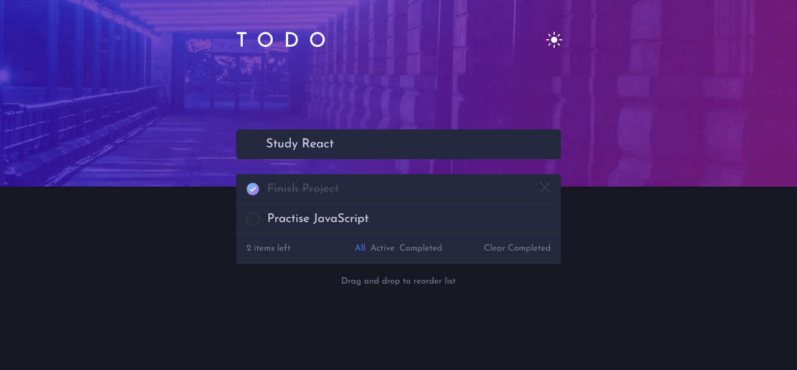
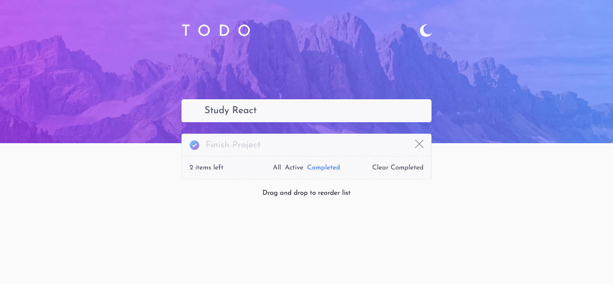
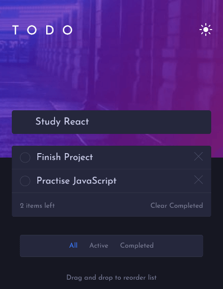
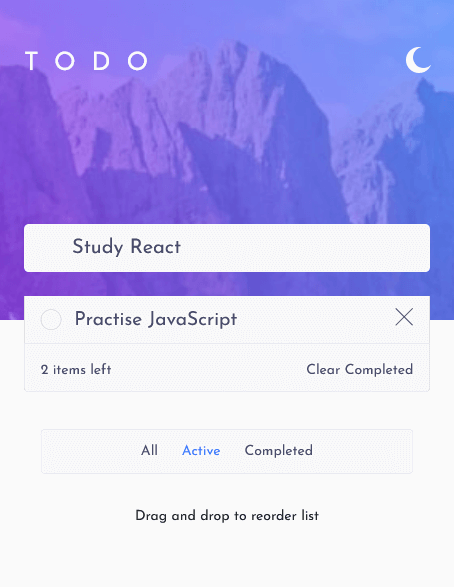

# Todo App

## Table of contents

- [Overview](#overview)
  - [The challenge](#the-challenge)
  - [Links](#links)
  - [Screenshot](#screenshot)
- [My process](#my-process)
  - [Built with](#built-with)
- [Author](#author)

## Overview

### The challenge

Users should be able to:

- View the optimal layout for the app depending on their device's screen size
- See hover states for all interactive elements on the page
- Add new todos to the list
- Mark todos as complete
- Delete todos from the list
- Filter by all/active/complete todos
- Clear all completed todos
- Toggle light and dark mode
- Drag and drop to reorder items on the list

### Links

- GitHub URL: [https://github.com/Nesh00/todo-app]
- Live Site URL: [https://todo-app-nenad.netlify.app/]

### Screenshot

## My process

### Built with

- Semantic HTML5 markup
- CSS custom properties
- Bootstrap 5
- Responsive Design
- Mobile-first workflow
- JavaScript
- ES6+
- SortableJS

## Author

- Nenad Tsvetanovski
- Frontend Mentor - [https://www.frontendmentor.io/profile/Nesh00]
- Twitter - [https://twitter.com/nenad37452460]
